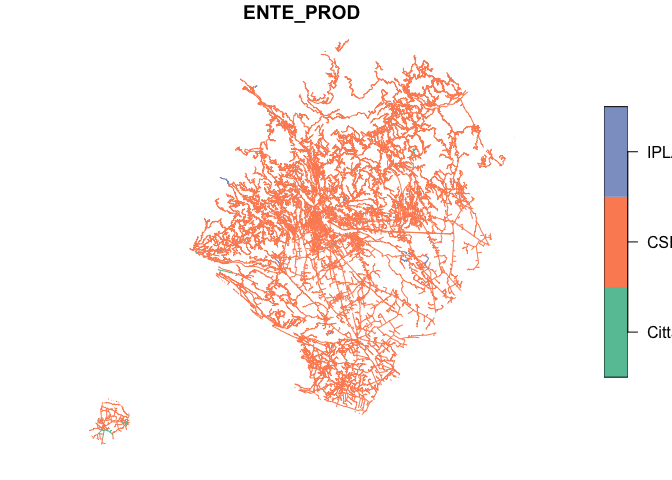
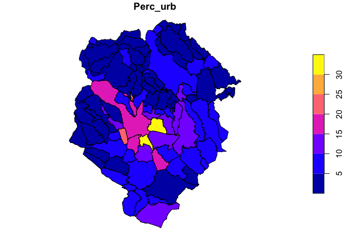

<!-- README.md is generated from README.Rmd. Please edit that file -->

# bdtre.download

<!-- badges: start -->
<!-- badges: end -->

Provides functionalities to download and manage in a simple way geodata
from the BDTRE database developed by the Piedmont geoportal.

What is the BDTRE (Base Dati Territoriale di Riferimento degli Enti)?
From the website <https://www.geoportale.piemonte.it/cms/bdtre/bdtre-2>:
“The Territorial Reference Database of the Bodies (BDTRE) is the
geographical database of the Piedmontese territory promoted by the
Piedmont Region, with the contents of a technical cartography,
structured according to the - Technical rules for the definition of the
content specifications of the geotopographic databases - nationally and
primarily aimed at supporting the planning, governance and protection of
the territory”.

From the following link:
<https://www.geoportale.piemonte.it/cms/bdtre/modalita-di-pubblicazione-e-fruizione>
it is possible to access to the different ways of using the database
that in previous years of the 2021 it was possible to download by single
municipality or by designing a polygonal area of limited size. Starting
in 2021, they have begun to offer the possibility of downloading in an
aggregate way, but still with time-consuming limitations.

The purpose of this work is to give the possibility to download the data
available on the platform through the R programming language in order to
reduce the time it would take through the platform and then make the
data available already in an organized mode.

From the BDTRE it is possible to download different geodata for each
municipality which are organized in different folders: - AMM: it
contains shp of the municipal boundaries both as polygon and multiline
and a punctual one for the municipal offices; - GEOFOTO: point shp with
network vertices; - IDRO: contains the shp with hydrographic data; -
IMM: contains multipolygonal shps of the surface of the buildings in the
municipality; - IND: contains both punctual and linear shps regarding
street classification and house numbers; - ORO: contains shp regarding
the orography of the territory; - PERT: contains shp regarding the
division of appurtenances between buildings and between public and
private land; - SERV: contains shp regarding service infrastructures
such as low and high voltage electricity networks; - TOPO: contains data
on toponymy; - VEG: contains shp regarding agricultural, wooded and
other types of natural areas. - VIAB: contains information about road
infrastructure, including roads and railways;

On the basis of the selections made by the user, the final function of
the program returns in a single shp for all the territory downloaded the
same categories within the previously mentioned folders.

The work is also available as Jupyter notebook at the following link:
<https://github.com/Magio94/Download_BDTRE/blob/main/Download%20BDTRE.ipynb>

## Installation

You can install the package from Github (first, you need to install the
devtools package):

``` r
install_github("Magio94/bdtre.download")
```

## How use the package and examples of functionalities

### Get municipality identification codes

The National Institute of Statistics (ISTAT) entrusts each municipality
with an identification number, the same for the province and for the
regions. The BDTRE uses these numbers at the municipal level to download
the data according to the one selected.

For example for the BDTRE of the 2021:
<http://www.datigeo-piem-download.it/static/regp01/BDTRE2021_VECTOR/BDTRE_DATABASE_GEOTOPOGRAFICO_2021-LIMI_COMUNI_10_GAIMSDWL->
YOU CAN INSERT HERE THE NUMBER YOU NEED -EPSG32632-SHP.zip

To automatically download the data for each municipality, the
identification numbers must first be downloaded. ISTAT offers a
permanent link in csv format that can be read directly in R. The
following function downloads the table and extracts the information for
the Piedmont region only.

Filter the data frame by province codes Using this fucntion the user can
decide to store the municipality codes by province or for all the
region. This will return a dataframe to filter the other function by
downloading the selection made here from the BDTRE database.

The user can select the municipalities by province putting as input
‘001’ (Torino), ‘002’ (Vercelli), ‘003’ (Novara), ‘004’ (Cuneo), ‘005’
(Asti), ‘006’ (Alessandria), ‘096’ (Biella), ‘103’ (Verbano) or ‘All’ to
save the municipality codes for all the region

Here you find the result for one selection:

``` r
library(bdtre.download)

## how use the get_municipality_codes function

Biella_province <- get_municipality_codes("096")
print(Biella_province)
#>      Cod_Prov Cod_Mun             Name_Mun
#> 1035      096  096001              Ailoche
#> 1036      096  096002        Andorno Micca
#> 1037      096  096003                Benna
#> 1038      096  096004               Biella
#> 1039      096  096005              Bioglio
#> 1040      096  096006             Borriana
#> 1041      096  096007            Brusnengo
#> 1042      096  096008           Callabiana
#> 1043      096  096009            Camandona
#> 1044      096  096010           Camburzano
#> 1045      096  096012              Candelo
#> 1046      096  096013              Caprile
#> 1047      096  096014            Casapinta
#> 1048      096  096015    Castelletto Cervo
#> 1049      096  096016             Cavaglià
#> 1050      096  096018             Cerrione
#> 1051      096  096019             Coggiola
#> 1052      096  096020              Cossato
#> 1053      096  096021           Crevacuore
#> 1054      096  096023               Curino
#> 1055      096  096024               Donato
#> 1056      096  096025              Dorzano
#> 1057      096  096026           Gaglianico
#> 1058      096  096027            Gifflenga
#> 1059      096  096028              Graglia
#> 1060      096  096030              Magnano
#> 1061      096  096031             Massazza
#> 1062      096  096032            Masserano
#> 1063      096  096033 Mezzana Mortigliengo
#> 1064      096  096034            Miagliano
#> 1065      096  096035            Mongrando
#> 1066      096  096037          Mottalciata
#> 1067      096  096038              Muzzano
#> 1068      096  096039                Netro
#> 1069      096  096040  Occhieppo Inferiore
#> 1070      096  096041  Occhieppo Superiore
#> 1071      096  096042           Pettinengo
#> 1072      096  096043               Piatto
#> 1073      096  096044         Piedicavallo
#> 1074      096  096046              Pollone
#> 1075      096  096047            Ponderano
#> 1076      096  096048              Portula
#> 1077      096  096049             Pralungo
#> 1078      096  096050                 Pray
#> 1079      096  096053       Ronco Biellese
#> 1080      096  096054              Roppolo
#> 1081      096  096055              Rosazza
#> 1082      096  096056       Sagliano Micca
#> 1083      096  096057        Sala Biellese
#> 1084      096  096058            Salussola
#> 1085      096  096059          Sandigliano
#> 1086      096  096063            Sordevolo
#> 1087      096  096064             Sostegno
#> 1088      096  096065               Strona
#> 1089      096  096066           Tavigliano
#> 1090      096  096067             Ternengo
#> 1091      096  096068             Tollegno
#> 1092      096  096069             Torrazzo
#> 1093      096  096071             Valdengo
#> 1094      096  096072          Vallanzengo
#> 1095      096  096074    Valle San Nicolao
#> 1096      096  096075               Veglio
#> 1097      096  096076              Verrone
#> 1098      096  096077    Vigliano Biellese
#> 1099      096  096078      Villa del Bosco
#> 1100      096  096079   Villanova Biellese
#> 1101      096  096080             Viverone
#> 1102      096  096081               Zimone
#> 1103      096  096082              Zubiena
#> 1104      096  096083             Zumaglia
#> 1105      096  096085              Lessona
#> 1106      096  096086      Campiglia Cervo
#> 1107      096  096087     Quaregna Cerreto
#> 1108      096  096088            Valdilana
```

### Download BDTRE database for each municipality desired

The program based on the number of the municipality stored in the
variable made by the function get_municipality_codes will download the
corresponding data. It is possible either to use the codes of the list
pre-set by province or to build your own list with the desired
municipalities by making another filter.

The program is built to create subfolders starting from the position
where the code is made run one. It starts from the creation of a folder
called “Downloaded” and the program does not create a new folder in case
you want to download other data for other provinces or for a list
selected by the user since each time it checks if the same folder name
exists.

It also creates an additional sub-folder for each municipality.

In the following example we are just downloading a province:

``` r
library(bdtre.download)

## download from the database the data from the desired municipalities by province

download_municipality(Biella_province)
#> [1] "The \"Downloaded\" folder already existed"
#> Warning in deparse(substitute(municipality_number), " folder already existed"):
#> NA introdotti per coercizione
#> Warning in deparse(substitute(municipality_number), " folder already existed"):
#> 'cutoff' non valido per 'deparse', si utilizza il valore predefinito
#> [1] "The Biella_province"
#> [1] "Downloaded 1 municipalities of 74"
#> [1] "Downloaded 2 municipalities of 74"
#> [1] "Downloaded 3 municipalities of 74"
#> [1] "Downloaded 4 municipalities of 74"
#> [1] "Downloaded 5 municipalities of 74"
#> [1] "Downloaded 6 municipalities of 74"
#> [1] "Downloaded 7 municipalities of 74"
#> [1] "Downloaded 8 municipalities of 74"
#> [1] "Downloaded 9 municipalities of 74"
#> [1] "Downloaded 10 municipalities of 74"
#> [1] "Downloaded 11 municipalities of 74"
#> [1] "Downloaded 12 municipalities of 74"
#> [1] "Downloaded 13 municipalities of 74"
#> [1] "Downloaded 14 municipalities of 74"
#> [1] "Downloaded 15 municipalities of 74"
#> [1] "Downloaded 16 municipalities of 74"
#> [1] "Downloaded 17 municipalities of 74"
#> [1] "Downloaded 18 municipalities of 74"
#> [1] "Downloaded 19 municipalities of 74"
#> [1] "Downloaded 20 municipalities of 74"
#> [1] "Downloaded 21 municipalities of 74"
#> [1] "Downloaded 22 municipalities of 74"
#> [1] "Downloaded 23 municipalities of 74"
#> [1] "Downloaded 24 municipalities of 74"
#> [1] "Downloaded 25 municipalities of 74"
#> [1] "Downloaded 26 municipalities of 74"
#> [1] "Downloaded 27 municipalities of 74"
#> [1] "Downloaded 28 municipalities of 74"
#> [1] "Downloaded 29 municipalities of 74"
#> [1] "Downloaded 30 municipalities of 74"
#> [1] "Downloaded 31 municipalities of 74"
#> [1] "Downloaded 32 municipalities of 74"
#> [1] "Downloaded 33 municipalities of 74"
#> [1] "Downloaded 34 municipalities of 74"
#> [1] "Downloaded 35 municipalities of 74"
#> [1] "Downloaded 36 municipalities of 74"
#> [1] "Downloaded 37 municipalities of 74"
#> [1] "Downloaded 38 municipalities of 74"
#> [1] "Downloaded 39 municipalities of 74"
#> [1] "Downloaded 40 municipalities of 74"
#> [1] "Downloaded 41 municipalities of 74"
#> [1] "Downloaded 42 municipalities of 74"
#> [1] "Downloaded 43 municipalities of 74"
#> [1] "Downloaded 44 municipalities of 74"
#> [1] "Downloaded 45 municipalities of 74"
#> [1] "Downloaded 46 municipalities of 74"
#> [1] "Downloaded 47 municipalities of 74"
#> [1] "Downloaded 48 municipalities of 74"
#> [1] "Downloaded 49 municipalities of 74"
#> [1] "Downloaded 50 municipalities of 74"
#> [1] "Downloaded 51 municipalities of 74"
#> [1] "Downloaded 52 municipalities of 74"
#> [1] "Downloaded 53 municipalities of 74"
#> [1] "Downloaded 54 municipalities of 74"
#> [1] "Downloaded 55 municipalities of 74"
#> [1] "Downloaded 56 municipalities of 74"
#> [1] "Downloaded 57 municipalities of 74"
#> [1] "Downloaded 58 municipalities of 74"
#> [1] "Downloaded 59 municipalities of 74"
#> [1] "Downloaded 60 municipalities of 74"
#> [1] "Downloaded 61 municipalities of 74"
#> [1] "Downloaded 62 municipalities of 74"
#> [1] "Downloaded 63 municipalities of 74"
#> [1] "Downloaded 64 municipalities of 74"
#> [1] "Downloaded 65 municipalities of 74"
#> [1] "Downloaded 66 municipalities of 74"
#> [1] "Downloaded 67 municipalities of 74"
#> [1] "Downloaded 68 municipalities of 74"
#> [1] "Downloaded 69 municipalities of 74"
#> [1] "Downloaded 70 municipalities of 74"
#> [1] "Downloaded 71 municipalities of 74"
#> [1] "Downloaded 72 municipalities of 74"
#> [1] "Downloaded 73 municipalities of 74"
#> [1] "Downloaded 74 municipalities of 74"
```

### Example of download by a user list¶

The user can also using the following function download just the
interested municipalities in case he/she knows the number codes by
inserting them inside a vector. This function helps the user to produce
a data frame with the same structure produced by the
get_municipality_codes function, but just for interested municipalities
and you can pass it inside the function download_municipality as we did
in the example before fo the Biella province.

``` r
library(bdtre.download)

# create a vector to select the desired municipalities and pass them in the fucntion
user_list <- c('003016', '005008', '006004', '002035')

user_selection <- download_selected_mun(user_list)

print(user_selection)
#>   Cod_Mun
#> 1  003016
#> 2  005008
#> 3  006004
#> 4  002035
```

### selection_path function

Example of how the function work by finding all the path relative to one
selected shp for all the municipalities downloaded

``` r
library(bdtre.download)

selection_path('limi_comuni_piem')
#>  [1] "Downloaded/Biella_province/096001/AMM/limi_comuni_piem_2021.shp"
#>  [2] "Downloaded/Biella_province/096002/AMM/limi_comuni_piem_2021.shp"
#>  [3] "Downloaded/Biella_province/096003/AMM/limi_comuni_piem_2021.shp"
#>  [4] "Downloaded/Biella_province/096004/AMM/limi_comuni_piem_2021.shp"
#>  [5] "Downloaded/Biella_province/096005/AMM/limi_comuni_piem_2021.shp"
#>  [6] "Downloaded/Biella_province/096006/AMM/limi_comuni_piem_2021.shp"
#>  [7] "Downloaded/Biella_province/096007/AMM/limi_comuni_piem_2021.shp"
#>  [8] "Downloaded/Biella_province/096008/AMM/limi_comuni_piem_2021.shp"
#>  [9] "Downloaded/Biella_province/096009/AMM/limi_comuni_piem_2021.shp"
#> [10] "Downloaded/Biella_province/096010/AMM/limi_comuni_piem_2021.shp"
#> [11] "Downloaded/Biella_province/096012/AMM/limi_comuni_piem_2021.shp"
#> [12] "Downloaded/Biella_province/096013/AMM/limi_comuni_piem_2021.shp"
#> [13] "Downloaded/Biella_province/096014/AMM/limi_comuni_piem_2021.shp"
#> [14] "Downloaded/Biella_province/096015/AMM/limi_comuni_piem_2021.shp"
#> [15] "Downloaded/Biella_province/096016/AMM/limi_comuni_piem_2021.shp"
#> [16] "Downloaded/Biella_province/096018/AMM/limi_comuni_piem_2021.shp"
#> [17] "Downloaded/Biella_province/096019/AMM/limi_comuni_piem_2021.shp"
#> [18] "Downloaded/Biella_province/096020/AMM/limi_comuni_piem_2021.shp"
#> [19] "Downloaded/Biella_province/096021/AMM/limi_comuni_piem_2021.shp"
#> [20] "Downloaded/Biella_province/096023/AMM/limi_comuni_piem_2021.shp"
#> [21] "Downloaded/Biella_province/096024/AMM/limi_comuni_piem_2021.shp"
#> [22] "Downloaded/Biella_province/096025/AMM/limi_comuni_piem_2021.shp"
#> [23] "Downloaded/Biella_province/096026/AMM/limi_comuni_piem_2021.shp"
#> [24] "Downloaded/Biella_province/096027/AMM/limi_comuni_piem_2021.shp"
#> [25] "Downloaded/Biella_province/096028/AMM/limi_comuni_piem_2021.shp"
#> [26] "Downloaded/Biella_province/096030/AMM/limi_comuni_piem_2021.shp"
#> [27] "Downloaded/Biella_province/096031/AMM/limi_comuni_piem_2021.shp"
#> [28] "Downloaded/Biella_province/096032/AMM/limi_comuni_piem_2021.shp"
#> [29] "Downloaded/Biella_province/096033/AMM/limi_comuni_piem_2021.shp"
#> [30] "Downloaded/Biella_province/096034/AMM/limi_comuni_piem_2021.shp"
#> [31] "Downloaded/Biella_province/096035/AMM/limi_comuni_piem_2021.shp"
#> [32] "Downloaded/Biella_province/096037/AMM/limi_comuni_piem_2021.shp"
#> [33] "Downloaded/Biella_province/096038/AMM/limi_comuni_piem_2021.shp"
#> [34] "Downloaded/Biella_province/096039/AMM/limi_comuni_piem_2021.shp"
#> [35] "Downloaded/Biella_province/096040/AMM/limi_comuni_piem_2021.shp"
#> [36] "Downloaded/Biella_province/096041/AMM/limi_comuni_piem_2021.shp"
#> [37] "Downloaded/Biella_province/096042/AMM/limi_comuni_piem_2021.shp"
#> [38] "Downloaded/Biella_province/096043/AMM/limi_comuni_piem_2021.shp"
#> [39] "Downloaded/Biella_province/096044/AMM/limi_comuni_piem_2021.shp"
#> [40] "Downloaded/Biella_province/096046/AMM/limi_comuni_piem_2021.shp"
#> [41] "Downloaded/Biella_province/096047/AMM/limi_comuni_piem_2021.shp"
#> [42] "Downloaded/Biella_province/096048/AMM/limi_comuni_piem_2021.shp"
#> [43] "Downloaded/Biella_province/096049/AMM/limi_comuni_piem_2021.shp"
#> [44] "Downloaded/Biella_province/096050/AMM/limi_comuni_piem_2021.shp"
#> [45] "Downloaded/Biella_province/096053/AMM/limi_comuni_piem_2021.shp"
#> [46] "Downloaded/Biella_province/096054/AMM/limi_comuni_piem_2021.shp"
#> [47] "Downloaded/Biella_province/096055/AMM/limi_comuni_piem_2021.shp"
#> [48] "Downloaded/Biella_province/096056/AMM/limi_comuni_piem_2021.shp"
#> [49] "Downloaded/Biella_province/096057/AMM/limi_comuni_piem_2021.shp"
#> [50] "Downloaded/Biella_province/096058/AMM/limi_comuni_piem_2021.shp"
#> [51] "Downloaded/Biella_province/096059/AMM/limi_comuni_piem_2021.shp"
#> [52] "Downloaded/Biella_province/096063/AMM/limi_comuni_piem_2021.shp"
#> [53] "Downloaded/Biella_province/096064/AMM/limi_comuni_piem_2021.shp"
#> [54] "Downloaded/Biella_province/096065/AMM/limi_comuni_piem_2021.shp"
#> [55] "Downloaded/Biella_province/096066/AMM/limi_comuni_piem_2021.shp"
#> [56] "Downloaded/Biella_province/096067/AMM/limi_comuni_piem_2021.shp"
#> [57] "Downloaded/Biella_province/096068/AMM/limi_comuni_piem_2021.shp"
#> [58] "Downloaded/Biella_province/096069/AMM/limi_comuni_piem_2021.shp"
#> [59] "Downloaded/Biella_province/096071/AMM/limi_comuni_piem_2021.shp"
#> [60] "Downloaded/Biella_province/096072/AMM/limi_comuni_piem_2021.shp"
#> [61] "Downloaded/Biella_province/096074/AMM/limi_comuni_piem_2021.shp"
#> [62] "Downloaded/Biella_province/096075/AMM/limi_comuni_piem_2021.shp"
#> [63] "Downloaded/Biella_province/096076/AMM/limi_comuni_piem_2021.shp"
#> [64] "Downloaded/Biella_province/096077/AMM/limi_comuni_piem_2021.shp"
#> [65] "Downloaded/Biella_province/096078/AMM/limi_comuni_piem_2021.shp"
#> [66] "Downloaded/Biella_province/096079/AMM/limi_comuni_piem_2021.shp"
#> [67] "Downloaded/Biella_province/096080/AMM/limi_comuni_piem_2021.shp"
#> [68] "Downloaded/Biella_province/096081/AMM/limi_comuni_piem_2021.shp"
#> [69] "Downloaded/Biella_province/096082/AMM/limi_comuni_piem_2021.shp"
#> [70] "Downloaded/Biella_province/096083/AMM/limi_comuni_piem_2021.shp"
#> [71] "Downloaded/Biella_province/096085/AMM/limi_comuni_piem_2021.shp"
#> [72] "Downloaded/Biella_province/096086/AMM/limi_comuni_piem_2021.shp"
#> [73] "Downloaded/Biella_province/096087/AMM/limi_comuni_piem_2021.shp"
#> [74] "Downloaded/Biella_province/096088/AMM/limi_comuni_piem_2021.shp"
#> [75] "Downloaded/user_selection/001001/AMM/limi_comuni_piem_2021.shp"
```

### Apply the function for merging the shps inside the downloaded folder by the chosen category

The user can insert the argument inside the merging_shp between the
different choices in the list:

selection_list \<- c(‘lim_com’, ‘limi_comuni_piem’, ‘sed_amm’,
‘ab_cda_vert’, ‘el_idr_vert’, ‘nd_idr’, ‘af_acq’, ‘dre_sup’, ‘ghi_nv’,
‘invaso_vert’, ‘sp_acq’, ‘aatt’, ‘attr_sp’, ‘cr_edf’, ‘cs_edi’,
‘edi_min’, ‘ele_cp’, ‘un_vol’, ‘argine’, ‘diga’, ‘edifc’, ‘galler’,
‘man_tr’, ‘mn_arr’, ‘mn_int’, ‘mn_ind’, ‘mn_mau’, ‘mu_sos’, ‘ponte’,
‘tralic’, ‘acc_int’, ‘acc_pc_civico_tp_str’, ‘es_amm’, ‘tp_str’,
‘cv_liv_class’, ‘f_nter’, ‘pt_quo’, ‘a_tras’, ‘alveo’, ‘alveo_a’,
‘pe_uins’, ‘cv_aes’, ‘cv_dis’, ‘loc_sg’, ‘scr_cr’, ‘ar_vrd’, ‘bosco’,
‘cl_agr’, ‘for_pc’, ‘ps_inc’, ‘a_pveg’, ‘albero’, ‘fil_al’, ‘for_pc’,
‘ac_vei’, ‘ar_vms’, ‘el_str_tp_str’, ‘el_vms’, ‘gz_str’, ‘gz_vms’,
‘iz_str’, ‘tr_str’, ‘ac_cic’, ‘ac_ped’, ‘el_fer’, ‘gz_fer’, ‘sd_fer’,
‘nd_ele’, ‘tr_ele’, ‘v_rete’)

In the example streets shp was chosen:

``` r
library(bdtre.download)

## Example of merging one category from the downloaded data
nc_merge <- merging_shp('el_str_tp_str')
```

The following plot show the result of the merging made by the previous
function.

 ###
Calculate indicators for each municipalities¶

The function is an example of what can be achieved with the calculated
data. In this case, the function is used to calculate the urbanization
index based on the municipalities of interest. To obtain these data, a
list was first created from which the program reads the shp files that
indicate the urbanization elements for each municipality of interest.

Once the total urbanized area has been added, the percentage of
urbanization on the total surface is calculated. The latter is obtained
from the polygonal shp with the boundaries of the municipality.

``` r
library(bdtre.download)

## basic example code

data_frame_data <- percent_urbanized(Biella_province)
#> [1] "The percent of urbanized area for Ailoche is 1.70657466667157%"
#> [1] "The percent of urbanized area for Andorno Micca is 6.12606618398486%"
#> [1] "The percent of urbanized area for Benna is 7.66995922110783%"
#> [1] "The percent of urbanized area for Biella is 19.4253223170418%"
#> [1] "The percent of urbanized area for Bioglio is 2.72217651623219%"
#> [1] "The percent of urbanized area for Borriana is 6.60616979081811%"
#> [1] "The percent of urbanized area for Brusnengo is 8.5056452590561%"
#> [1] "The percent of urbanized area for Callabiana is 2.66182459097635%"
#> [1] "The percent of urbanized area for Camandona is 2.92921951889391%"
#> [1] "The percent of urbanized area for Camburzano is 9.56130382748247%"
#> [1] "The percent of urbanized area for Candelo is 12.2347839000446%"
#> [1] "The percent of urbanized area for Caprile is 1.4807446816855%"
#> [1] "The percent of urbanized area for Casapinta is 4.59017430548949%"
#> [1] "The percent of urbanized area for Castelletto Cervo is 5.16420971848516%"
#> [1] "The percent of urbanized area for Cavaglià is 13.5999620040174%"
#> [1] "The percent of urbanized area for Cerrione is 6.98688053477176%"
#> [1] "The percent of urbanized area for Coggiola is 2.59172466937795%"
#> [1] "The percent of urbanized area for Cossato is 14.7508235730712%"
#> [1] "The percent of urbanized area for Crevacuore is 6.3875926587011%"
#> [1] "The percent of urbanized area for Curino is 2.28120265032899%"
#> [1] "The percent of urbanized area for Donato is 4.37279893188028%"
#> [1] "The percent of urbanized area for Dorzano is 8.79919251656597%"
#> [1] "The percent of urbanized area for Gaglianico is 33.3333576739764%"
#> [1] "The percent of urbanized area for Gifflenga is 7.93233479815402%"
#> [1] "The percent of urbanized area for Graglia is 3.82683672515582%"
#> [1] "The percent of urbanized area for Magnano is 9.08999467374012%"
#> [1] "The percent of urbanized area for Massazza is 8.48038528284979%"
#> [1] "The percent of urbanized area for Masserano is 6.47343069420142%"
#> [1] "The percent of urbanized area for Mezzana Mortigliengo is 5.3570877194403%"
#> [1] "The percent of urbanized area for Miagliano is 21.537315759224%"
#> [1] "The percent of urbanized area for Mongrando is 8.46383695919024%"
#> [1] "The percent of urbanized area for Mottalciata is 6.44349367204103%"
#> [1] "The percent of urbanized area for Muzzano is 4.52234704324447%"
#> [1] "The percent of urbanized area for Netro is 4.68506896771995%"
#> [1] "The percent of urbanized area for Occhieppo Inferiore is 21.6426331147748%"
#> [1] "The percent of urbanized area for Occhieppo Superiore is 14.2136302734596%"
#> [1] "The percent of urbanized area for Pettinengo is 3.51676940048166%"
#> [1] "The percent of urbanized area for Piatto is 6.0608777755172%"
#> [1] "The percent of urbanized area for Piedicavallo is 0.964422017022706%"
#> [1] "The percent of urbanized area for Pollone is 4.43620583932738%"
#> [1] "The percent of urbanized area for Ponderano is 18.1418498283302%"
#> [1] "The percent of urbanized area for Portula is 3.80141770309145%"
#> [1] "The percent of urbanized area for Pralungo is 7.96150156487356%"
#> [1] "The percent of urbanized area for Pray is 9.27882387045533%"
#> [1] "The percent of urbanized area for Ronco Biellese is 10.4561156557266%"
#> [1] "The percent of urbanized area for Roppolo is 5.20788260154426%"
#> [1] "The percent of urbanized area for Rosazza is 1.4769718045374%"
#> [1] "The percent of urbanized area for Sagliano Micca is 3.8144334326504%"
#> [1] "The percent of urbanized area for Sala Biellese is 4.05875479400834%"
#> [1] "The percent of urbanized area for Salussola is 4.41993440119389%"
#> [1] "The percent of urbanized area for Sandigliano is 14.8805072948843%"
#> [1] "The percent of urbanized area for Sordevolo is 3.93059244898629%"
#> [1] "The percent of urbanized area for Sostegno is 2.03944675624581%"
#> [1] "The percent of urbanized area for Strona is 10.2524793831257%"
#> [1] "The percent of urbanized area for Tavigliano is 2.90201007818445%"
#> [1] "The percent of urbanized area for Ternengo is 5.09070489583609%"
#> [1] "The percent of urbanized area for Tollegno is 17.0479890064246%"
#> [1] "The percent of urbanized area for Torrazzo is 3.44017689666682%"
#> [1] "The percent of urbanized area for Valdengo is 14.6426165255179%"
#> [1] "The percent of urbanized area for Vallanzengo is 1.7363070243213%"
#> [1] "The percent of urbanized area for Valle San Nicolao is 2.84678923055367%"
#> [1] "The percent of urbanized area for Veglio is 4.05470871849549%"
#> [1] "The percent of urbanized area for Verrone is 17.2140461081047%"
#> [1] "The percent of urbanized area for Vigliano Biellese is 31.2799928856476%"
#> [1] "The percent of urbanized area for Villa del Bosco is 4.71563973835272%"
#> [1] "The percent of urbanized area for Villanova Biellese is 3.24830581382082%"
#> [1] "The percent of urbanized area for Viverone is 6.34266400964284%"
#> [1] "The percent of urbanized area for Zimone is 7.07203684328434%"
#> [1] "The percent of urbanized area for Zubiena is 4.34031515482173%"
#> [1] "The percent of urbanized area for Zumaglia is 9.12745993921803%"
#> [1] "The percent of urbanized area for Lessona is 8.73925179708345%"
#> [1] "The percent of urbanized area for Campiglia Cervo is 2.25879975075999%"
#> [1] "The percent of urbanized area for Quaregna Cerreto is 13.8873288992232%"
#> [1] "The percent of urbanized area for Valdilana is 6.15155334390232%"
```

The user can also perform the same calculation for specific
municipalities already downloaded, but as input, there must be a
variable composed in the same way as the dataframe obtained by the
get_municipality_codes function. To do this, you need to filter the list
obtained from the same function for the istat code of the municipalities
on which you want to make the calculation. Below is an example of how to
do it:

``` r
library(bdtre.download)

# get the data fram of the province where the municiplaity is 
mun_code <- get_municipality_codes('001')

# filter just the municipality
selected_mun_urban <- mun_code[which(mun_code$Cod_Mun == '001001'), ]

# download the desired municipality
user_selection <- download_selected_mun("001001")
download_municipality(user_selection)
#> [1] "The \"Downloaded\" folder already existed"
#> Warning in deparse(substitute(municipality_number), " folder already existed"):
#> NA introdotti per coercizione
#> Warning in deparse(substitute(municipality_number), " folder already existed"):
#> 'cutoff' non valido per 'deparse', si utilizza il valore predefinito
#> [1] "The user_selection"
#> [1] "Downloaded 1 municipalities of 1"

# fit the variable inside the percent_urbanized function
data_frame_data2 <- percent_urbanized(selected_mun_urban)
#> [1] "The percent of urbanized area for Agliè is 8.56397139937146%"
```

At the end in the following plot it is possible to see an example of
what can be produced with the percent_urbanized function. The map shows
the level of urbanization for each municipality of the chosen province.

    #> 
    #> Caricamento pacchetto: 'dplyr'
    #> I seguenti oggetti sono mascherati da 'package:stats':
    #> 
    #>     filter, lag
    #> I seguenti oggetti sono mascherati da 'package:base':
    #> 
    #>     intersect, setdiff, setequal, union


